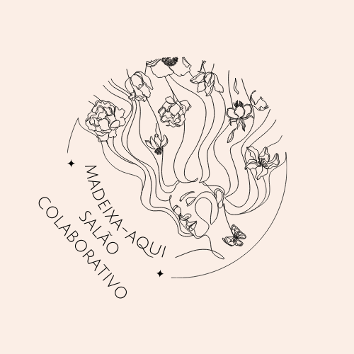
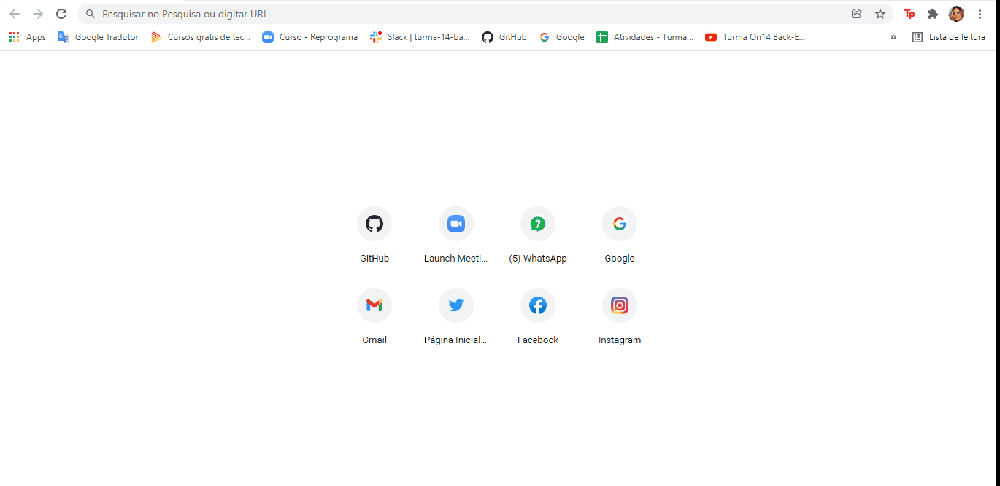
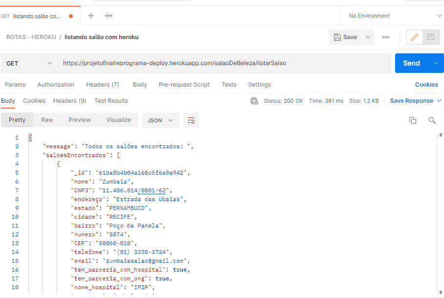
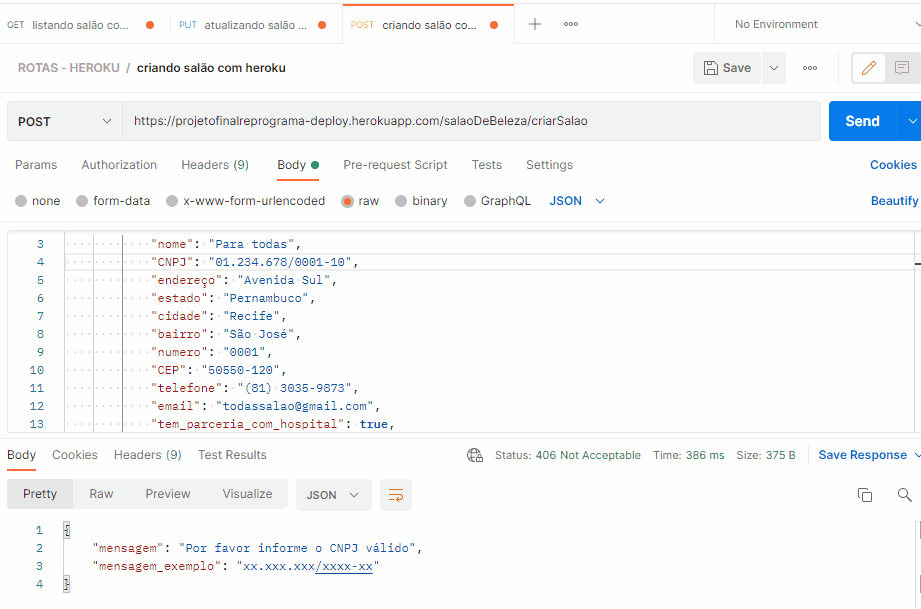
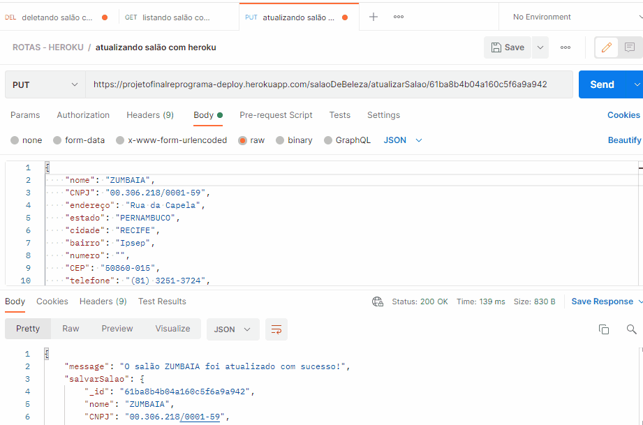
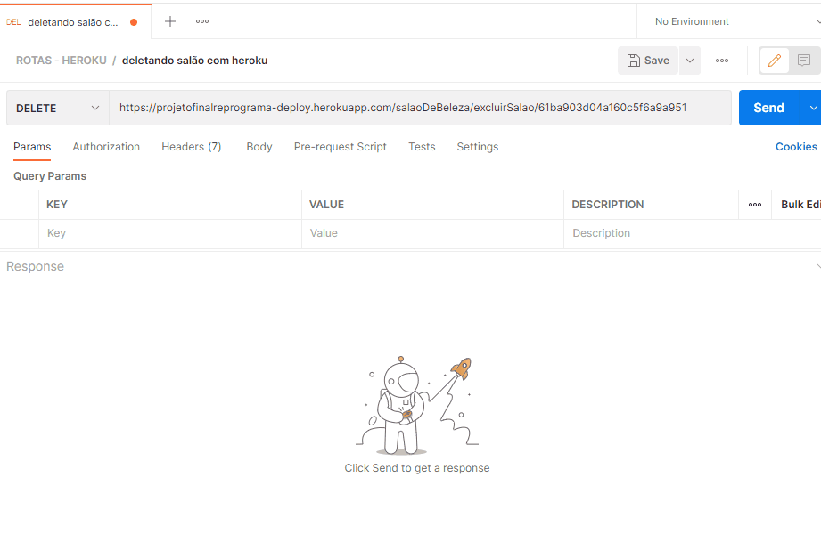
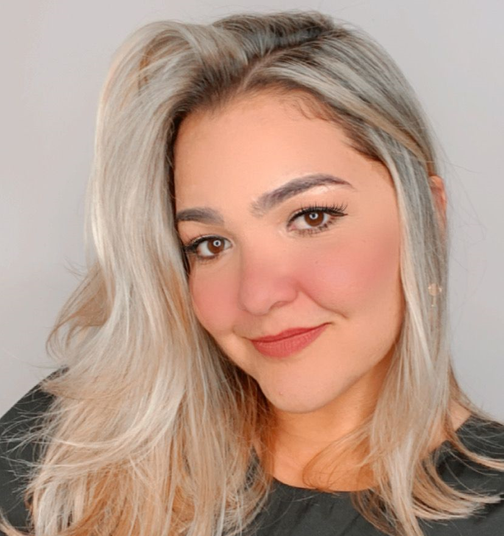

<h1 align="center">
     
    
Projeto Final {Reprograma} - Turma ON14 - API: Madeixa-Aqui Salão Solidário 

</h1>

 

 

## - :white_circle: O projeto

O projeto tem o nome de "Madeixa-aqui: salão solidário" e foi fruto da ideia de juntar uma coisa que eu amo e faz parte do meu dia a dia e uma causa social: cabelos + doação de cabelos para mulheres em tratamento contra o câncer de mama. Segundo dados divulgados pelo Instituto Nacional de Câncer (INCA) no ano de 2014, o câncer de mama foi o tipo mais frequente de câncer em mulheres no Brasil e no mundo. (Sociedade Brasileira de Patologia). E uma consequência do tratamento dessa doença, é a perda de cabelo devivo a quimioterapia. E por saber que o cabelo faz parte da personalidade/identidade e o quanto a perca dele pode mexer diretamente na auto-estima da mulher e visando diminuir a dificuldade desse momento delicado e aumentar a acessabilidade, existem iniciativas de ONGs e hospitais que aceitam doações de cabelo humano, recém-cortado, para a produção de perucas e/ou apliques para essas mulheres. Além disso, por que não poder reaproveitar esse cabelo que iria para o lixo e poder usá-lo para ao menos melhorar a auto-estima de outra pessoa? 

Mas como moradora de Recife - Pernambuco, toda vez que vou cortar meu cabelo e quero realizar esse tipo de ação já senti e ainda sinto sinto dificuldade de concretizá-la por não saber quem ou qual lugar procurar. Também já ouvi o mesmo sentimento de pessoas próximas e que por muitas vezes já deixaram de doar pelo mesmo motivo. Portanto, pensando nisso, a proposta deste projeto foi a criação de uma API Rest (?) onde podem ser cadastrados salões de beleza que tenham parceria com essas ONGs e/ou hospitais, esses salões também podem ter suas informações alteradas e podem ser procurados e listados para o/a/e usuário/usuária/usuárie na hora da pesquisa. Por enquanto, ainda é restrito para a região de Recife mas com intenção de aumentar. 

O "Madeixa-aqui: salão solidário" é o projeto final para a conclusão do bootcamp da turma On14 de programação back-end da :purple_heart:{reprograma}:purple_heart: e foi feito com muito carinho. 

 
 

## - :white_circle: Referências 

- [SBP](http://www.sbp.org.br/)
- [INCA](https://www.inca.gov.br/)
- [Artigo UNIFAC](https://www.unifacvest.edu.br/assets/uploads/files/arquivos/d90c0-anna-claudia-nunes-petry--a-representacao-da-perda-do-cabelo-em-mulheres-com-cancer-de-mama-2018.pdf)

 

## - :white_circle: Objetivo

Parceria entre salões de beleza e instituições que produzam perucas e/ou apliques com cabelos doados após o corte para mulheres que passaram perda de cabelo devivo ao ratamento contra o câncer de mama.
 

 

## - :white_circle: Funcionalidades
- :chart: Cadastrar salões que tenham parcerias com ONGs 
- :chart: Cadastrar salões que tenham parcerias com hospitais
- :chart: Localizar salões em parcerias com ONGs e/ou hospitais
- :chart: Atualizar cadastros dos salões 
- :chart: Deletar salões que não tenham parcerias

 

## - :white_circle: Tecnologias utilizadas nesse projeto

 

- :link: [JavaScript](https://www.javascript.com/)
- :link: [Git/Github](https://github.com/)
- :link: [Node.js](https://nodejs.org/en/)
- :link: [MongoDb](https://www.mongodb.com/)
- :link: [MongoCompass](https://www.mongodb.com/pt-br/products/compass)
- :link: [MongoDBatlas](https://www.mongodb.com/cloud/atlas)
- :link: [Postman](https://www.postman.com/)
- :link: [Vscode](https://code.visualstudio.com/)
- :link: [heroku](https://dashboard.heroku.com/apps)  

 

 

## - :white_circle: Acessando as rotas dos salões de beleza:

| Função | Método | Rota |
|---------|--------|------|
| Acessar aos salões | GET | `/salaoDeBeleza/listarSalao` |
| Cadastrar novos salões | POST | `/salaoDeBeleza/criarSalao` |
| Atualizar salão por id | PUT | `/salaoDeBeleza/atualizarSalao/:id` |
| Remover salão por id | DELETE | `/salaoDeBeleza/excluirSalao/:id` |

 

## - :white_circle: Rotas

- :fast_forward: Acessando o projeto pela rota local do [Postman](https://www.postman.com/):

* Rota local: http://localhost:5005

- :fast_forward: Acessando o projeto pela rota pública do [Heroku](https://dashboard.heroku.com/apps) 

* Rota Heroku: https://projetofinalreprograma-deploy.herokuapp.com/salaoDeBeleza

 

 

## - :arrows_clockwise: Rota GET no Heroku

<h1 align="center">
  

</h1>

 

 

## - :arrows_clockwise: Rota GET no Postman

<h1 align="center">
  

</h1>

 

 

## - :arrows_clockwise: Rota POST no Postman

<h1 align="center">
  

</h1>

 

 

## - :arrows_clockwise: Rota PUT no Postman

<h1 align="center">
  

</h1>

 

 

## - :arrows_clockwise: Rota DEL no Postman

<h1 align="center">
  

</h1>

 

 

## - :white_circle: Aprendizados com o projeto

Neste projeto aprendemos a criar uma API com um CRUD, que são quatro funções básicas para manipular dados em um sistema que utilize banco de dados. Sendo elas: criar (CREAT), ler (READ), atualizar (UPDATE) e deletar (DELETE).

 

 

## - Melhorias :warning: / Propostas posteriores :eight_spoked_asterisk: 

- :warning: Aumentar o alcance por local (mais cidades, incluir estados, outros estados e etc);

- :warning: Ter uma rota para poder localizar o estabelecimento por bairro, posteriormente por cidade/estado/região;

- :warning: Criar um cartão de fidelidade onde a cada quantidade X que ele for ao salão e corte o cabelo para doação ele ganhe algum produto, incentivando mais pessoas a voltarem e doarem cada vez mais;

- :warning: Desenvolver uma API voltada para os salões captarem os clientes; 

- :eight_spoked_asterisk: Tornar este projeto também comercial, podendo gerar lucro, para que uma parte desse lucro também possa ser doada para outras instituições voltadas para ajuda de mulheres com câncer de mama;

- :eight_spoked_asterisk: Poder fazer propostas de ofertas com empresas maiores com o intuito de beneficiar o cliente que for utilizar dos serviços dos salões, os próprios salões e as instutições que irão receber os cabelos doados.

 

 

## - :sparkles: :heart: Agradecimentos :sparkles: :heart:

Este projeto eu dedico e agradeço a {reprograma :purple_heart:} pela oportunidade de poder fazer parte dessa 

comunidade incrível de aprendizado não só de código, mas de dia-a-dia, de ajuda, de crescimento profissional e 

pessoal. À todas as minhas {reprogramadas - backend :purple_heart:} minhas amigas da turma On-14 que fizeram desses 4 

meses melhores do que o esperado, em especial a Leticia Desiderio e Xênia Barros. 

## Gratidão !! :sparkles: :heart:

 

 

## - :hospital: :house: Hospitais que recebem cabelos para doação em Recife - Pernambuco
 

- [Hospital do Câncer de Pernambuco](https://www.hcp.org.br/index.php/doacoes-cabelo)
- [IMIP](http://www1.imip.org.br/imip/home/index.html)
- [GAC - Pernambuco](http://www.gac.org.br/#)
- 

## - :woman: Autora

 
:sparkles: :sparkles: :sparkles: :sparkles: :sparkles: :sparkles: :sparkles: 

<h1 align="center">
  

:sparkles: :sparkles: :sparkles: :sparkles: :sparkles: :sparkles: :sparkles:
</h1>

:sparkles: :sparkles: :sparkles: :sparkles: :sparkles: :sparkles: :sparkles:
 

Olá, meu nome é Amanda Santos. Sou de Recife - Pernambuco - Brasil, onde nasci e moro até hoje. 

Sou formada em Ciências Biológicas pela Universidade Federal Rural de Pernambuco e estou em processo de

transição de carreira para a área de T. I. onde me identifiquei com a programação back-end e nesse caminho

encontrei a reprograma e consegui entrar para o bootcamp em Ago/21 e consegui crescer e aprender mais sobre o mundo

do back-end e gostar ainda mais.

 

 

## - :iphone: :computer: Contato e Redes Sociais
 

- :iphone: Telefone: (81) 98626-0170
- [Gmail](amandamsilvasantos96@gmail.com)
- [GitHub](https://github.com/Amandasantos24)
- [LinkedIn](www.linkedin.com/in/amandasantos24)
- [Instagram](https://www.instagram.com/amandaaleaal/)

 

 

## - :white_circle: Referências e inspirações para o README

 

- [Elisabete Alves](https://github.com/elisabetealves/reprograma-estante-de-historias)

- [Priscila Estevão](https://github.com/priscilaestevao/pretitudes-project-reprograma)

- [Rafael Xavier](https://gist.github.com/rxaviers)

- [Diana Regina](https://dev.to/reginadiana/como-escrever-um-readme-md-sensacional-no-github-4509#o-que-%C3%A9-o-readme)

 