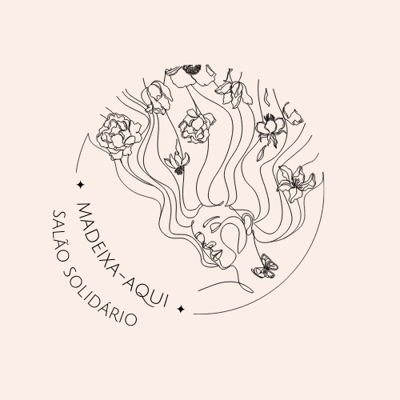

<h1 align="center">
     
    
Projeto Final {Reprograma}

</h1>

 

 

## - O projeto

- Este projeto é um trabalho final para conclusão do bootcamp da {reprograma} para formação em programação back-end. Ele surgiu a partir do meu grande interesse pela área da estética, principalmente quando é sobre cabelo.
E sabendo que o cabelo é uma parte da nossa identidade visual e da nossa personalidade, pensei em juntar o que me agrada com uma intenção de ajudar outras mulheres.
Baseado nas minhas experiências de ir em salões de beleza para cortar o meu cabelo e muitas vezes querer doa-lo para 
-falar sobre querer doar o cabelo
-falar sobre amigas que não doam o cabelo
-falar sobre aproveitar
-falar sobre o cancer de mama e mulheres que perdem o cabelo
-não ver muito isso em recife
- juntar salão e hospitais

 

 

## - Objetivo
> > Parceria entre salões de beleza e instituições que produzam perucas com cabelos doados para mulheres que passaram perda de cabelo devivo ao câncer de mama.
 

 

## - Funcionalidades
[X] Cadastrar salões que tenham parcerias com ONGs e
[X] Cadastrar salões que tenham parcerias com hospitais
[X] Localizar salões em parcerias com ONGs e/ou hospitais
[X] Atualizar cadastros dos salões 
[X] Deletar salões que não tenham parcerias
[X] Cadastrar salões de beleza que cortam cabelos para doação
[X] Cadastrar ONGs que produzem perucas para mulheres com câncer
[X] Aumentar a facilidade de pessoas que querem cortar e doar o próprio cabelo
[X] Aumentar a confiança da cliente que está disposta a esse tipo de serviço, garantindo que o produto chegará em quem precisa
 

## - Tecnologias utilizadas nesse projeto

 

- [JavaScript](https://www.javascript.com/)
- [Git/Github](https://github.com/)
- [Node.js](https://nodejs.org/en/)
- [MongoDb](https://www.mongodb.com/)
- [MongoCompass](https://www.mongodb.com/pt-br/products/compass)
- [MongoDBatlas](https://www.mongodb.com/cloud/atlas)
- [Postman](https://www.postman.com/)
- [Vscode](https://code.visualstudio.com/)
- [heroku](https://dashboard.heroku.com/apps)  

 

## - Rotas

> Acessando o projeto pela rota local do [Postman] (https://www.postman.com/):

* Rota local: http://localhost:5005

> Acessando o projeto pela rota pública do [Heroku] 

* Rota Heroku: https://projetofinalreprograma-deploy.herokuapp.com/salaoDeBeleza

 

 

## - Acessando as rotas dos salões de beleza pelos CRUD do projeto:

| Função | Método | Rota |
|---------|--------|------|
| Acesso aos salões | GET | `/salaoDeBeleza/listarSalao` |
| Cadastro de novos salões | POST | `/salaoDeBeleza/criarSalao` |
| Atualização de salão por id | PUT | `/salaoDeBeleza/atualizarSalao/:id` |
| Remoção de salão por id | DELETE | `/salaoDeBeleza/excluirSalao/:id` |

 

 

## - Aprendizados com o projeto

Neste projeto aprendemos a criar uma API com um CRUD, que são quatro funções básicas para manipular dados em um sistema que utilize banco de dados. Sendo eles: criar (CREAT), ler (READ), atualizar (UPDATE) e deletar (DELETE).

melhorar isso aqui

 

 

## - Melhorias para o projeto

- procurar por bairro
- tornar um projeto não só social como comercial,
- estender para outros locais,
- melhorar o código para poder procurar por local e bairro,
- fazer parcerias com empresas grandes beneficiando o cliente, o salão e o orgão que irá receber,
- doar uma parte para hospitais e ou instituições de caridade,
- criar um cartão de fidelidade para mais clientes terem acessos,
- criar uma API para salões procurarem clientes e não só clientes procurarem salões

 

 

## - Agradecimentos

- falar de leticia
- falar de xenia
- falar de reprograma
- falar do grupo

 

 

## - Autora

- falar sobre mim 

 

 

## - Redes Sociais

- GitHub (https://github.com/Amandasantos24)
- LinkedIn (www.linkedin.com/in/amandasantos24)
- Instagram (https://www.instagram.com/amandaaleaal/)

 